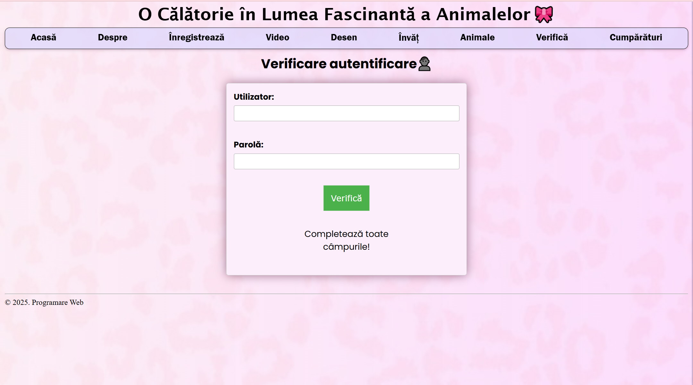

# A Journey into the Fascinating World of Animals (Web Project)

This project was developed as part of the **Web Programming** course to apply fundamental web development concepts through a practical and interactive website.  

## Description

An educational website about animals featuring informative pages, images, and a simple simulated shopping section. The goal is to present animal-related content interactively and accessibly.

## Technologies Used

- HTML, CSS, JavaScript
- Python (web server)

